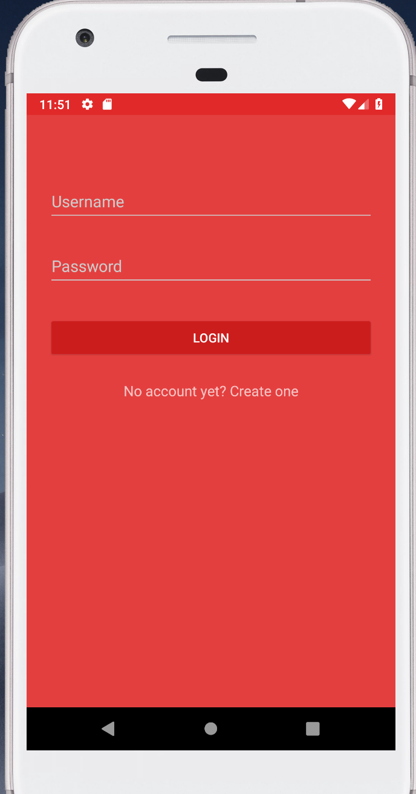

# 2018-group-18
# Welcome to Food Mate World!

We have built the basic framework and implemented some core features. Feel free to play with our app!

## Back End

For back end we choose springboot and h2 database as server and database to store user and restaurant information. The whole project is under restful-web-services folder. To run the whole projects, user Intellij to import the whole project, waiting for dependency downloaded, and click run button, you are ready to go!

### Recommender System

We currently implemented an SVD-based collaborative filtering system to perform ranking on all available hosts according to the history of the guest and his/her similarity with other guests. The core code is currently using Python and called by Java ProcessBuilder class. We will consider rewrite it in Java and add more logic on top of that. 

Some python packages are needed to run the whole project. run

`pip install -r requirement.txt`

`pip install -r requirement1.txt`

Since the packages in requirement1.txt are depend on packages in requirement.txt, the order is important.

There is an easy way to check our server! We deployed the whole server on Heroku, so you can eaily check the endpoint of our server by accessing: https://food-mate.herokuapp.com as the base url, the detail of endpoints are stored in FoodMate.postman_collection.json.

### Currently Implemented endpoint

**GET /users**

Acquire username, fullName, description and E-mail information of all users using view control (sensitive information like password, username etc. got filtered out – for security reason).

**POST /login**

Simple login functionality, for each user, check username and password, if login success, return userId as string. Otherwise return “-1”

**POST /register**

Simple register functionality. Take in user object (with username, password, personal informations etc in it) and save using userRepository. Return uri of created user (expose uri).

**GET /user/{id}**

This one is similar to /users but instead of getting information(of course, the view got filtered) of all users, if search user object by user id and after filtering return view for this user.

**DELETE /user/{id}**

Pretty self-explanatory. This one deletes user from userRepository by id.

**GET /user{id}/host/restaurants **

(The recommendation module comes into play) we used matching algorithm(collaborative filtering algorithm, https://en.wikipedia.org/wiki/Collaborative_filtering)  to recommend top k(by default, 10) restaurants for host. 

**GET /user/{id}/host/posts**

Get post history of host (referenced by ID). 

**POST /user/{id}/host/posts/{restaurantId}**

Host create POST end point. This one is used for host to post POST (e.g. which restaurant, time, preferences etc). The restaurant information is referenced by restaurant ID(from restaurantRepository) and the host information is referenced by user id(from userRepository). And the post containing all those information is stored in POST, which is persisted to postRepository 

**GET /user/{id}/host/posts/{postId}/guests**

Get guest information(referenced by user id) who responded to post(posted by host).

**POST /user/{id}/host/posts/{postId}/guests/{guestId}**

This end point is used by host to reject guest. The rejection method takes in host’s user id, guest’s user id, post id s.t. guest is rejected by host from post.

**DELETE /user/{id}/host/posts/{post_id}**

Host delete post.

**POST /user/{id}/guest/{post_id}**

Guest join POST (accept invitation from host). More concretely, post information is updated with new guest information stored in post. Weblistener is used such that this process could be asynchronized (for example, it doesn’t make sense to have host waiting in the whole invitation process, which is why a weblistener is used here).

**GET /user/{id}/guest/posts**

For guest to look up all joined posts.

## Backend test

We also implemented some Unit tests to test the correctness of our logic.

Path to the test file: src/test/java/com/oose/group18/Controller/SpringDataJpaTest.java

which includes 5 tests:

(1)   Find user by id

(2)   Find user name

(3)   Find restaurant by Id

(4)   Find all user

(5)   Find all restaurant

## Front End

Now let's look at our Android App!

We designed and implemented the UI sketch and implemented some core features for the interaction between user and server. The whole project is under FoodMate folder. 

To build the project, use Android studio to import the whole project, waiting for the project to compile, then click run button, you will be asked to choose the USB device or simulator. SInce the target sdk version is 21, we strongly recommend you to use Android version larger than this level. For most of the testing, we use Pixel 28 as the simulator, so it will give you the best user experience.

Now let's take a look at our app!

### Login

The initial page is the login page. User need to enter username and password to login. You can use the registered account (it's in our database): username: Amy, password Amy to login.

Wanna create your own account? No problem! Click create one will send you to registration page where you can fill your basic information to create a new account. Then you will jump to login page to login will your own account.

### Choose Role

User can choose to be host or guest.

### Host:

After choosing to be host, the user can get a list of recommended restaurants (by our recommendation system!). Then the user can choose the restaurant he/she likes to make a post.

### Send Post

Then the user can fill the form and send the post to the server and wait for guests to join.

[TO IMPLEMENT]
### Guest

After choosing to be guest, the user will receive a list of recommended posts. The guest can choose which post he/she likes to join.

# Food Mate app

Lots of people have to eat alone and want company, so we want to develop a mobile app to help people look for “food-mates”. By using this app, we hope to connect strangers through food. We allow users to post invitations to dine together at specified times at restaurants they choose, and others can make requests to join. This app matches people who are in need of company and share the same love for food. In the not too distant future, we can imagine newer version of the app can serve as a social network for people sharing the same interests.
